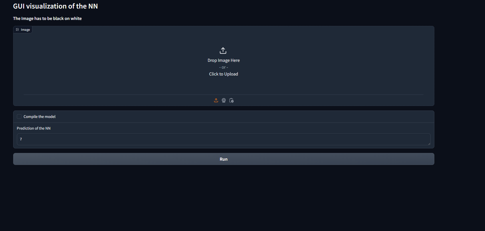

# MNIST

## Description

This repository contains a project developed for Hack Club. It implements a Convolutional Neural Network (CNN) to recognize handwritten digits from the [MNIST dataset](https://en.wikipedia.org/wiki/MNIST_database). For an introduction to neural networks, see this [guide](https://www.3blue1brown.com/lessons/neural-networks).

## Requirements

* Python >= 3.8

**Setting Up the Environment**

Run the appropriate setup script for your operating system:

* Windows: `./setup.bat`
* Linux/macOS: `./setup.sh`

These scripts likely install required dependencies, and build a virtual environment for you if you don't have one.

## Running the Program

1. Navigate to the `bin` directory: `cd bin`

2. Choose your method:

   * **GUI:** `python MNIST_gui.py [--help]` (use `python3` on Linux/macOS)  
   This will launch the GUI for testing the neural network, it will open the browser automatically.

   

   * **Model:** `python MNIST.py [--help]` (use `python3` on Linux/macOS)  
   This will run the model via command line interface.

   The `--help` flag displays available command-line arguments.

   

## Usage

### GUI

The GUI allows for an interactive experience to test the neural network. Follow the on-screen instructions and see the model's predictions in real-time.

### CLI

The command-line interface allows for training and testing the model through specified arguments. Use the --help flag to explore available options.

## Author

Neetre
